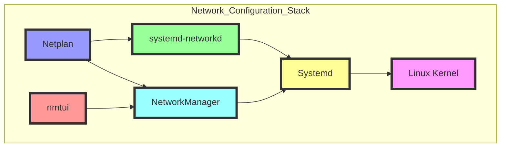
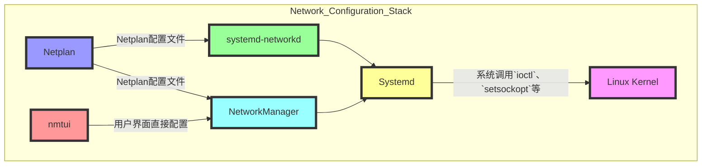
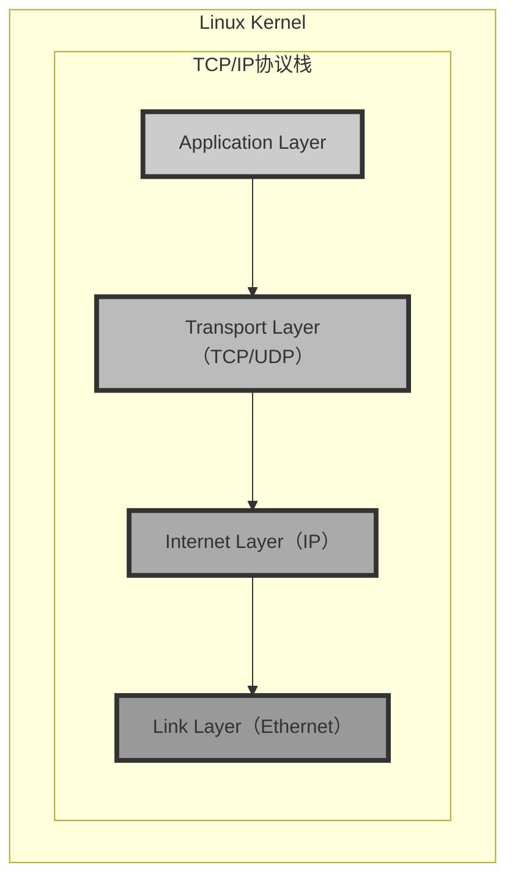
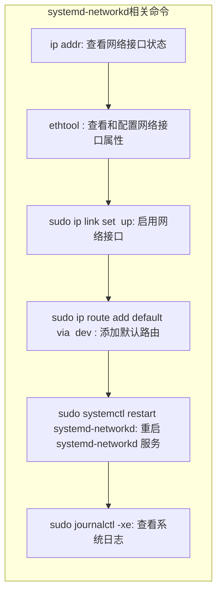
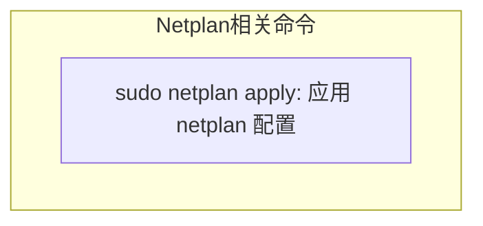
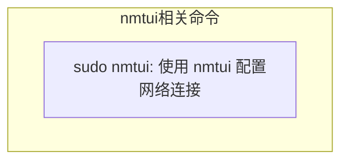
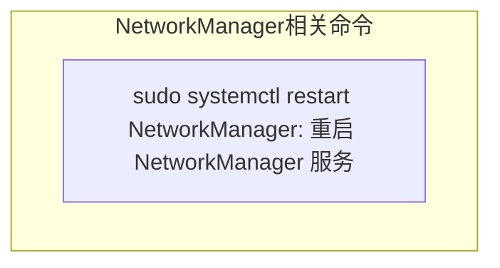
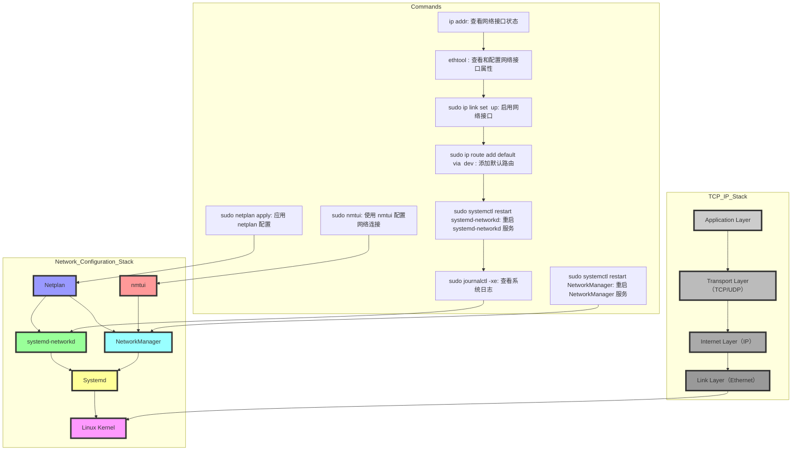

# 一、环境介绍
- Description: Ubuntu 20.04.6 LTS
- Release: 20.04


# 二、问题描述

Ubuntu服务器从18.04升级到20.04版本后，网卡好像无法连接至直连的交换机，因此无法连接局域网，因而也无法在局域网下使用ssh对他进行连接

# 三、开始解决

首先我用显示器直接连接了后端服务器，输入命令：
```bash
ps axj | grep sshd
```
![[Pasted image 20240801151425.png]]
排查了sshd是否已经启动，发现sshd工作正常，因此怀疑是网络连接的问题。

## 3.1 开始排查网络连接

因为原先在Ubuntu18的版本下，运维同学在配置网络的时候使用的是Netplan组件，但是由于升级的缘故，这个Netplan组件以及NetworkManager和nmtui工具可能被移除了，因此执行下面的命令失败：
```bash
nmtui
netplan apply
```

![[Pasted image 20240801152746.png]]

但是运维的同学保留了以前使用netplan配置时的配置文件，从配置文件中可以看到当时给服务器分配的静态IP地址、网关IP地址、以及网络接口号（当然这些IP地址都是内网的地址）：![[Pasted image 20240801153426.png]]
- 分配给服务器的IP地址：10.110.1.62/24
- 服务器的IPv4网关：10.110.1.1
- 服务器不使用DHCP来动态分配地址

## 3.2 了解了重要的IP地址之后，开始尝试别的网络配置方法

我使用命令：
```bash
ps axj | grep systemd-networkd
```
发现networkd能够正常工作：![[Pasted image 20240801153802.png]]

因此考虑重新配置system-networkd的配置文件，

### 1. **查看网络接口名称** 
首先，确认网络接口的名称。使用以下命令查看：
```bash
ip a
```
![[Pasted image 20240801154744.png]]

情况是ens8f0和ens8f1这两个接口都处于未激活的状态，后来知道是由于更新之后，网络接口的名称变动了，导致接口需要重新设置配置文件。

### 2. **创建网络配置文件**
   在 `/etc/systemd/network/` 目录下创建一个新的网络配置文件，如 `20-wired.network`。使用vim：
   ```bash
   touch /etc/systemd/network/20-wired.network
   vim /etc/systemd/network/20-wired.network
   ```

### 3. **配置网络**
   如果使用DHCP，配置文件内容应该如下：
```c
[Match]
Name=...

[Network]
DHCP=ipv4
```

但是我们的服务器采用静态IP，配置文件设置如下：
```c
[Match]
Name=ens8f0

[Network]
Address=10.110.1.62/24
Gateway=10.110.1.1
DNS=8.8.8.8 8.8.4.4
```

### 4. **启用和重启 `systemd-networkd` 服务**
```bash
sudo systemctl enable systemd-networkd
sudo systemctl restart systemd-networkd
```

### 5. **验证网络连接**
   检查网络接口是否已配置并连接网络：
```bash
ip a
ping 8.8.8.8
```


## 3.3 尝试配置路由表

配置后依然无法联网，连交换机都ping不通，我开始检查路由表
```bash
ip route
```
而输出的路由表只有一行127开头的本地环回地址：
```c
developer@ubuntu-server:~$ ip route
172.17.0.0/16 dev docker0 proto kernel scope link src 172.17.0.1 linkdown 
```

### 1. 尝试配置默认路由

```bash
ip route add default via 10.110.1.1 dev ens8f0
```
但是报错：`nexthop has invalid gateway`找不到下一跳。

再次使用 `ip addr show` 命令确认ens8f0接口的IP地址和子网掩码配置：
```bash
ip addr show ens8f0
```

发现其输出的结果中没有inet 10.110.1.62/24，即使手动添加ens8f0的IP地址和默认网关也不奏效，连接状态是 `DOWN`，并且 `NO-CARRIER` 表示没有检测到网络连接。


## 3.4 尝试其余端口

因此怀疑ens8f0这个端口没有网线连接，尝试检查其端口连接状态，使用如下命令：
```bash
sudo ethtool ens8f0
```

![[Pasted image 20240801161158.png]]
发现link detected为no，观察其余三个端口：
![[Pasted image 20240801161604.png]]

发现只有ens8f1是检测到物理连接的，也就是说连接交换机的网线对应的接口应该是ens8f1。

### 1. 更新配置文件
于是**更新 `/etc/systemd/network/20-wired.network` 文件**：

```c
[Match] 
Name=ens8f1  

[Network] 
Address=10.110.1.62/24 
Gateway=10.110.1.1 
DNS=8.8.8.8 8.8.4.4
```

### 2. **重启 `systemd-networkd` 服务**
```bash
sudo systemctl restart systemd-networkd
sudo systemctl status systemd-networkd
```
![[Pasted image 20240801162355.png]]

可以看到这个时候sshd的服务已经开始在22号端口监听连接了！


### 3. **确认接口状态和路由表**
```bash
ip addr show ens8f1
ip route
```
可用看到接口ens8f1的接口和路由都正确设置了
![[Pasted image 20240801162630.png]]
 
### 4. **测试网络连接**
```bash
ping 10.110.1.1
ping 8.8.8.8
ping google.com
```

网关、DNS服务器都能够ping通：![[Pasted image 20240801163043.png]]

自己的电脑在内网下，用ssh连接服务器，能够正常使用shell，问题解决。
![[Pasted image 20240801163315.png]]

# 四、经验总结

## 结构图

>网络配置组件

可以扩展一下箭头的内容




>网络协议栈


>相关命令





>梳理网络配置的流程

### 理论解释

1. **Linux Kernel**：
   - **角色**：最底层的操作系统内核，负责网络子系统的管理，包括协议栈的实现（如TCP/IP协议栈）、网络设备驱动程序和网络包处理。
   - **功能**：处理所有低级网络操作，包括数据包的发送和接收、路由、网络接口的管理等。

2. **Systemd**：
   - **角色**：系统和服务管理器，用于启动和管理系统服务，包括网络服务。
   - **功能**：提供 `systemd-networkd` 服务进行网络配置和管理。它充当网络配置工具与内核之间的桥梁。

3. **systemd-networkd**：
   - **角色**： `systemd` 项目的一部分，用于管理和配置网络接口。
   - **功能**：负责读取网络配置文件，配置网络接口（如分配IP地址、设置路由等），并将配置应用到内核网络子系统。

4. **NetworkManager**：
   - **角色**：用于简化和管理网络配置的守护进程，特别适用于桌面和移动设备。
   - **功能**：通过 `systemd` 进行通信，配置和管理网络接口，提供图形化和命令行工具供用户使用。

5. **Netplan**：
   - **角色**：配置工具，特定于Ubuntu发行版，用于简化网络配置。
   - **功能**：通过YAML文件描述网络配置，并将其应用到底层的网络管理工具，如 `systemd-networkd` 或 `NetworkManager`。

6. **nmtui**：
   - **角色**： `NetworkManager` 提供的文本用户界面，用于配置和管理网络连接。
   - **功能**：提供一个简单的交互界面，用户可以通过它来配置和管理网络连接。

### 网络配置流程

1. **配置文件**：用户在Netplan配置文件中描述网络设置（静态IP、网关、DNS等）。
2. **Netplan解析**：Netplan读取配置文件，将配置转换为 `systemd-networkd` 或 `NetworkManager` 可以理解的格式。
3. **调用systemd**：Netplan调用 `systemd` 提供的服务（如 `systemd-networkd`）应用配置。
4. **与内核交互**： `systemd-networkd` 将配置应用到内核网络子系统，管理网络接口的状态和配置。
5. **用户交互**：用户可以通过 `nmtui` 或 `NetworkManager` 提供的其他工具，实时查看和管理网络配置。

### 系统调用和内核交互

- **系统调用**： `systemd` 及其组件通过系统调用与内核进行交互，如 `ioctl`、`setsockopt` 等，用于配置网络接口、设置IP地址和路由等。
- **内核模块**：内核中的网络模块（如 `netlink`、`ip_tables` 等）处理来自用户空间的请求，执行具体的网络配置和管理任务。

### 总结

通过上述理论分析，可以看出，`systemd` 及其组件在网络配置中的核心作用。无论是 `Netplan` 还是 `NetworkManager`，都通过 `systemd` 进行网络配置，而 `systemd` 直接与内核网络子系统交互，完成具体的网络配置任务。这种架构设计确保了网络配置的灵活性和统一性，同时简化了用户的操作。


>汇总图




### 4.1 问题排查和解决过程总结

1. **确认网络接口状态**：
   使用 `ip addr` 命令查看所有网络接口的状态，并确认接口是否已分配IP地址和状态是否为 `UP`。

   ```bash
   ip addr
   ```

2. **检查接口配置文件**：
   确认 `/etc/systemd/network/` 目录下的网络配置文件内容是否正确。以下是一个配置示例：

   ```c
   [Match]
   Name=ens8f1

   [Network]
   Address=10.110.1.62/24
   Gateway=10.110.1.1
   DNS=8.8.8.8 8.8.4.4
   ```

3. **启用和检查网络接口**：
   手动启用网络接口并检查其状态：

   ```bash
   sudo ip link set ens8f1 up
   ip addr show ens8f1
   ```

4. **检查链路状态**：
   使用 `ethtool` 检查接口的链路状态：

   ```bash
   sudo ethtool ens8f1
   ```

5. **手动配置IP地址和路由**：
   在自动配置未生效时，手动添加IP地址和默认路由：

   ```bash
   sudo ip addr add 10.110.1.62/24 dev ens8f1
   sudo ip route add default via 10.110.1.1 dev ens8f1
   ```

6. **重启网络服务**：
   重启 `systemd-networkd` 服务以应用新的配置：

   ```bash
   sudo systemctl restart systemd-networkd
   ```

7. **验证网络连接**：
   通过ping命令测试网络连接：

   ```bash
   ping 10.110.1.1
   ping 8.8.8.8
   ping google.com
   ```

8. **检查系统日志**：
   查看系统日志以获取更多关于网络服务的信息：

   ```bash
   sudo journalctl -xe
   ```

### 4.2 涉及的所有Linux命令

- **查看网络接口状态**：
  ```bash
  ip addr
  ```

- **启用网络接口**：
  ```bash
  sudo ip link set <interface> up
  ```

- **显示特定接口的状态**：
  ```bash
  ip addr show <interface>
  ```

- **显示网络接口的详细信息**：
  ```bash
  sudo ethtool <interface>
  ```

- **手动配置IP地址和子网掩码**：
  ```bash
  sudo ip addr add <ip_address>/<subnet_mask> dev <interface>
  ```

- **手动添加默认网关**：
  ```bash
  sudo ip route add default via <gateway_ip> dev <interface>
  ```

- **重启 `systemd-networkd` 服务**：
  ```bash
  sudo systemctl restart systemd-networkd
  ```

- **检查 `systemd-networkd` 服务状态**：
  ```bash
  sudo systemctl status systemd-networkd
  ```

- **检查系统日志**：
  ```bash
  sudo journalctl -xe
  ```

- **测试网络连接**：
  ```bash
  ping <ip_address_or_hostname>
  ```

### 4.3 总结

在排查网络问题时，重要的是有系统化的步骤和方法。通过以上步骤，我们能够逐步确认物理连接、网络配置和服务状态，最终定位并解决问题。确保在配置过程中检查物理连接和接口状态，是快速解决网络问题的关键。

