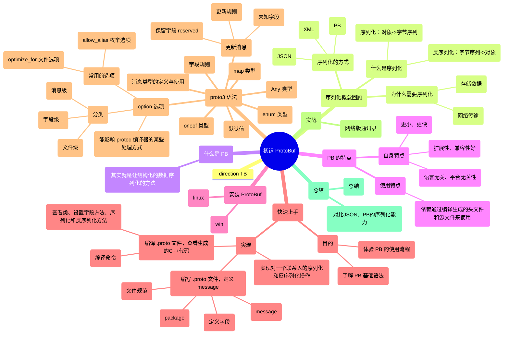

python tools/train.py -c configs/yolov3_mouse_other/main.yml -r output/mouse_other_1/main/55.pdparams --eval --use_vdl=true --vdl_log_dir=vdl_dir/scalar


paddledetection中，提供的现成的visualdl的可视化面板（即使用visualdl --logdir vdl_dir/scalar/ 命令调出的面板）能看到的训练细节是很少的，只有loss的标量图，我想看到更多的可视化的训练过程的细节。应该如何实现？我附上paddlepaddle的visualdl的说明文档


`--json_eval` 和 `--classwise` 选项可以提供更详细的评估信息，这对于全面记录训练细节非常有帮助。下面是这两个选项的具体作用：

1. **`--json_eval`**：
   - 作用：通过已存在的 `bbox.json` 或 `mask.json` 文件进行评估。可以提供详细的评估结果并保存为 JSON 文件，便于后续分析和共享。
   - 适用情况：如果你希望保存和查看详细的评估结果，尤其是当你需要多次对比评估结果时，这个选项非常有用。

2. **`--classwise`**：
   - 作用：评估单个类别的 AP（平均精度）并绘制单个类别的 PR（精度-召回）曲线。可以帮助你了解每个类别的检测效果，识别性能较差的类别以进行针对性改进。
   - 适用情况：如果你希望深入分析每个类别的检测效果，尤其是在多类别检测任务中，这个选项非常有帮助。

综合考虑，如果你希望全面记录训练的细节并进行深入的性能分析，建议使用这两个选项。以下是修改后的命令：

```bash
python tools/train.py -c configs/yolov3_mouse_other/main.yml --eval --use_vdl=true --vdl_log_dir=vdl_dir/scalar
```

这样，你可以获得更加详细和全面的训练和评估记录，包括各类别的评估结果和详细的评估数据，便于后续分析和改进模型。


python tools/train.py -c configs/yolov3_mouse_other/main.yml -r output/mouse_other_1/main/43.pdparams --use_vdl=true --vdl_log_dir=vdl_dir/scalar

推理结果显示有很多低置信度的检测框，并且存在许多误检和重叠框。为了改善这种现象，可以在训练和推理参数上进行以下调整：

### 训练参数调整

1. **增加训练数据**：更多的训练数据可以帮助模型更好地学习目标特征。如果可能，收集更多的标注数据。

2. **数据增强**：使用更丰富的数据增强技术来增加训练数据的多样性，提高模型的泛化能力。例如：
   - 随机裁剪
   - 颜色抖动
   - 随机翻转
   - 随机缩放

3. **学习率调整**：如果模型训练过程中的损失没有显著下降，可能需要调整学习率。尝试使用学习率预热（warmup）或调整学习率衰减策略。

4. **损失函数权重调整**：适当调整各个损失函数的权重，以平衡位置损失（loss_xy、loss_wh）、分类损失（loss_cls）和对象存在损失（loss_obj）。

5. **增加训练轮次（epochs）**：增加训练轮次可以让模型有更多的时间去学习特征。

### 推理参数调整

1. **增加 `draw_threshold`**：提高 `draw_threshold` 可以过滤掉置信度较低的检测框。尝试将其设置为 0.6 或更高。

2. **调整 `keep_top_k`**：减少 `keep_top_k` 的值，可以限制输出的检测框数量，从而减少误检和重叠框。尝试设置为 50 或更少。

### 配置示例

以下是一个新的配置示例，假设你要重新训练并应用这些调整：

```yaml
metric: VOC
map_type: integral
num_classes: 3  # 确认你的类数量

TrainDataset:
  name: VOCDataSet
  dataset_dir: dataset/dog_mouse_other_voc
  anno_path: train.txt
  label_list: label_list.txt
  data_fields: ['image', 'gt_bbox', 'gt_class', 'difficult']

EvalDataset:
  name: VOCDataSet
  dataset_dir: dataset/dog_mouse_other_voc
  anno_path: valid.txt
  label_list: label_list.txt
  data_fields: ['image', 'gt_bbox', 'gt_class', 'difficult']

TestDataset:
  name: ImageFolder
  anno_path: dataset/dog_mouse_other_voc/label_list.txt

LearningRate:
  base_lr: 0.001
  schedulers:
  - !PiecewiseDecay
    gamma: 0.1
    milestones:
    - 80  # 调整衰减点
    - 90
  - !LinearWarmup
    start_factor: 0.
    steps: 4000

OptimizerBuilder:
  optimizer:
    momentum: 0.9
    type: Momentum
  regularizer:
    factor: 0.0005
    type: L2

# 保存路径更新
weights: output/yolov3_my_dog_mouse_voc_new/model_final.pdparams
save_dir: output/yolov3_my_dog_mouse_voc_new
```

### 推理命令

调整后的推理命令示例：

```sh
python tools/infer.py -c configs/yolov3/yolov3_my_dog_mouse_voc.yml --infer_img=demo/mouse1.jpg --output_dir=infer_output/ --draw_threshold=0.6 -o weights=output/yolov3_my_dog_mouse_voc_new/model_final.pdparams -o keep_top_k=50
```

### 数据增强示例

在 `yolov3_reader.yml` 文件中添加数据增强配置：

```yaml
TrainReader:
  sample_transforms:
    - Decode: {}
    - RandomDistort: {}  # 颜色抖动
    - RandomExpand: {}  # 随机扩展
    - RandomCrop: {}  # 随机裁剪
    - RandomFlip: {}  # 随机翻转
    - NormalizeImage: {}
    - Permute: {}
    - PadBatch: {}
  batch_size: 8
  shuffle: true
  drop_last: true
  mixup_epoch: -1
  use_shared_memory: true

EvalReader:
  sample_transforms:
    - Decode: {}
    - NormalizeImage: {}
    - Permute: {}
  batch_size: 1
```

通过以上调整，可以提高模型的检测精度，减少误检和重叠框。如果有任何问题或需要进一步帮助，请告诉我。